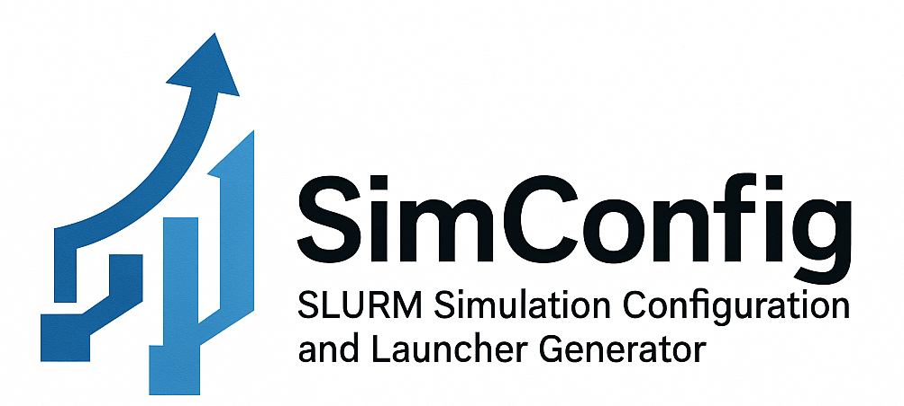

<p align="center">
  
</p>

<p align="center">
  <b>Automate the creation of parameterized simulations and SLURM launchers for HPC clusters</b><br>
  <i>Developed by Juan F. Restrepo — CONICET / Universidad Nacional de Entre Ríos</i>
</p>

---

## 📖 Introduction

SimConfig is a Python package for configuring and launching parameterized
simulation batches on SLURM clusters. It allows defining simulation variables
and environments directly inside your source files (`.py` or `.m`), then
auto-generates simulation files, SBATCH scripts, and launcher files for
efficient execution.

---

## 📂 Table of Contents

- [Installation](#installation)
- [Usage](#usage)
- [Configuration Format](#configuration-format)
- [Features](#features)
- [Output](#output)
- [Examples](#examples)
- [Troubleshooting](#troubleshooting)
- [Contributors](#contributors)
- [License](#license)

---

## 💾 Installation

### From GitHub

```bash
pip install git+https://github.com/jrestrepo86/simconfig.git
```

### Local Installation

```bash
git clone https://github.com/jrestrepo86/simconfig.git
cd simconfig
pip install .
```

### Development Mode

```bash
pip install -e .
```

---

## ▶️ Usage

From the command line, run:

```bash
simconfig file.py     # For Python simulations
simconfig file.m      # For MATLAB simulations
```

This will:

1. Parse `[SimConfig]` and `[SlurmConfig]` blocks in the file.
2. Generate all combinations of parameter values.
3. Create simulation files and corresponding SLURM scripts.
4. Produce launchers and a global run script.

---

## 🛠️ Configuration Format

Embed your configuration as a multi-line comment in Python or MATLAB files.

### Python Example

```
python
"""
[SimConfig]
name='E01'
variables={'condition':[1,2],'pathology':[1,3]}
realizations={'exp01':2}
pyexecutable='python3.10'
venv={'type': 'conda', 'env-name': 'base'}
[endSimConfig]

[SlurmConfig]
slurm = {
  'neptuno': [
    'mail-user=juan.restrepo@uner.edu.ar',
    'partition=internos',
    'nodes=1',
    'ntasks=24',
    'tasks-per-node=24',
  ],
  'jupiter': [
    'mail-user=juan.restrepo@uner.edu.ar',
    'partition=debug',
    'gres=gpu:1',
  ]
}
[endSlurmConfig]
"""


condition = 1
pathology = 1
exp01 = 1

print(f"condition={condition} pathology={pathology} exp01={exp01}")

```

### MATLAB Example

```
%{
[SimConfig]
name='E01'
variables={'condition':[1,2],'pathology':[1,3]}
realizations={'exp01':2}
matexecutable='matlab'
[endSimConfig]

[SlurmConfig]
slurm = {
  'neptuno': [
    'mail-user=juan.restrepo@uner.edu.ar',
    'tasks-per-node=24',
  ]
}
[endSlurmConfig]
%}

condition = 1;
pathology = 1;
exp01 = 1;

disp(['condition=' condition]);
disp(['pathology=' pathology]);
disp(['exp01=' exp01]);
```

---

## Virtual Environment Configuration

The [SimConfig] section can define a virtual environment to activate before
running simulations. Supported types:

- conda: Activates a conda environment.

- venv: Activates a Python virtual environment from a specified path.

Configuration options:

```
venv = {"type": "conda", "env-name": "base"}  # Default for conda is "base"
venv = {"type": "venv", "env-name": "./.venv"}  # Path to the Python venv
venv = {"type": "venv"}                         # No activation if path not given
```

---

## ✨ Features

- **Automatic file generation**: simulation scripts, SLURM scripts, group
  launchers, and global runner.
- **Virtual environment support**: Conda and Pip.
- **Platform-specific SLURM configs** for environments like `neptuno` or `jupiter`.
- **Structured naming** of output directories and filenames based on parameters.
- **Realization support** for multiple repetitions of each configuration.

---

## 📤 Output Structure

SimConfig will create the following:

```
bash
simconfig/
├── VAR_COMBO/                # Individual simulations
│   └── E01_C1P1T1.py
├── SBATCH/                   # SLURM job scripts
│   └── E01_C1P1T1.sh
├── launchers/
│   ├── jobs/                 # Job launcher scripts
│   └── C1_P1.sh              # Group launcher
├── run_E01.sh                # Main runner with conda activation
```

- `simconfig/VAR_COMBO/`: Folder for each parameter combination.
- `SBATCH/`: Folder containing SLURM job scripts.
- `launchers/jobs/`: Individual launch scripts.
- `launchers/GROUP.sh`: Grouped launchers for each parameter set.
- `run_<name>.sh`: Main executable to run all simulations and check the SLURM
  queue.

---

## 🧪 Examples

```bash
# Navigate to example directory
cd simconfig/examples

# Run SimConfig on Python script
simconfig example_python.py

# Or for MATLAB
simconfig example_matlab.m

# Then launch simulations
bash run_E01.sh
```

---

## 👥 Contributors

- Juan F. Restrepo (Author)
  [juan.restrepo@uner.edu.ar](mailto:juan.restrepo@uner.edu.ar)

---

## 📜 License

**MIT License** – Free for personal and commercial use. See the `LICENSE` file
or [MIT License](https://opensource.org/licenses/MIT).

---
